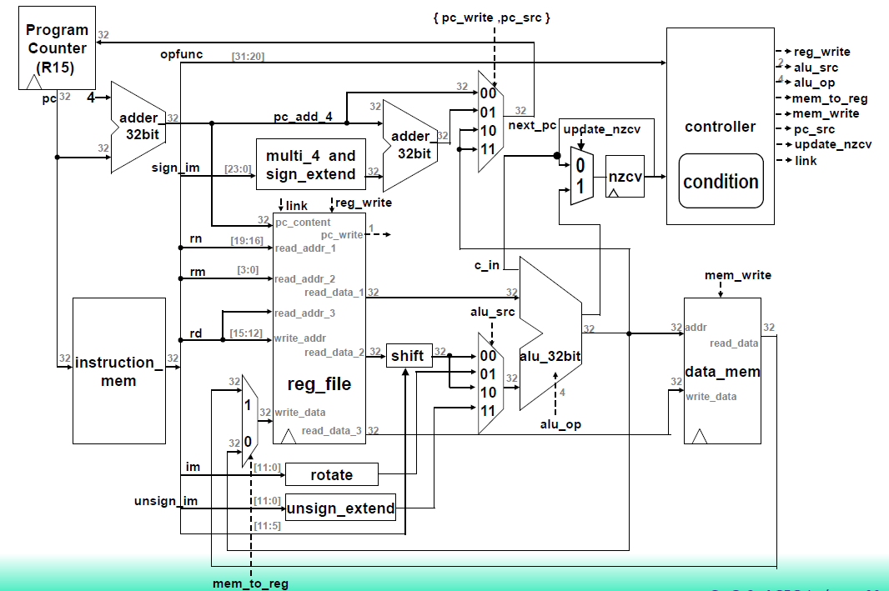

# A single cycle ARM CPU (32 bits)
- This is a final project for *LOGIC SYSTEM LABORATORY* in NCKUEE.

- Provides 4 testbenches for validation.
- You can run through all testbenches by running *run.bat* (if you have already installed **Icarus Verilog**).